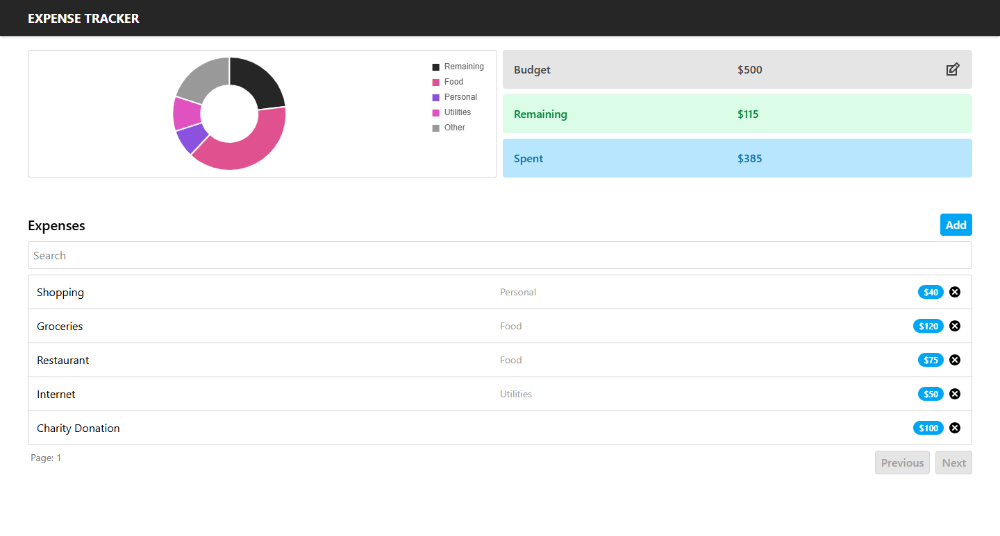

# React Expense Tracker

A modern and responsive **Expense Tracker Web App** built with **React**, **Tailwind CSS**, and **Chart.js**.  
It helps users manage their finances by tracking income and expenses with clean visuals and intuitive controls.



**Live Demo:** [View on Vercel](https://react-expense-tracker-omega-nine.vercel.app/)


## Features

- Add and remove income or expense transactions  
- Real-time balance, income, and expense tracking  
- Interactive charts powered by Chart.js  
- Persistent data storage using Local Storage  
- Responsive and modern UI built with Tailwind CSS  


## Tech Stack

- [React](https://react.dev/)  
- [Tailwind CSS](https://tailwindcss.com/)  
- [Chart.js](https://www.chartjs.org/)  
- [Local Storage API](https://developer.mozilla.org/en-US/docs/Web/API/Window/localStorage)  


## Installation & Setup

Follow these steps to run the project locally:

1. **Clone the repository**
   ```bash
   git clone https://github.com/mwildan-hafidz/react-expense-tracker.git
   ```

2. **Navigate into the project directory**
   ```bash
   cd react-expense-tracker
   ```

3. **Install dependencies**
   ```bash
   npm install
   ```

4. **Start the development server**
   ```bash
   npm run dev
   ```

5. Open your browser and visit:
   ```
   http://localhost:5173
   ```

You should now see the **React Expense Tracker** app running locally.


## Future Improvements

- Edit existing transactions  
- Filter transactions by date or category  
- Optional backend integration for multi-device sync  


## License

This project is licensed under the **MIT License** — feel free to use and modify it for your own projects.
